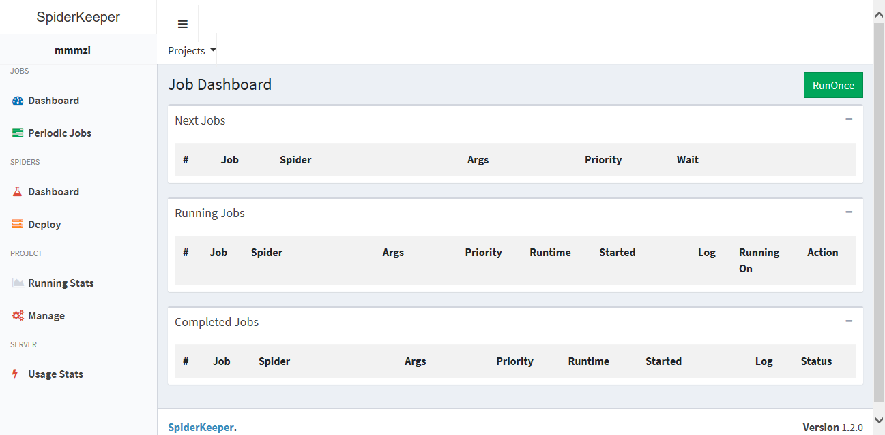
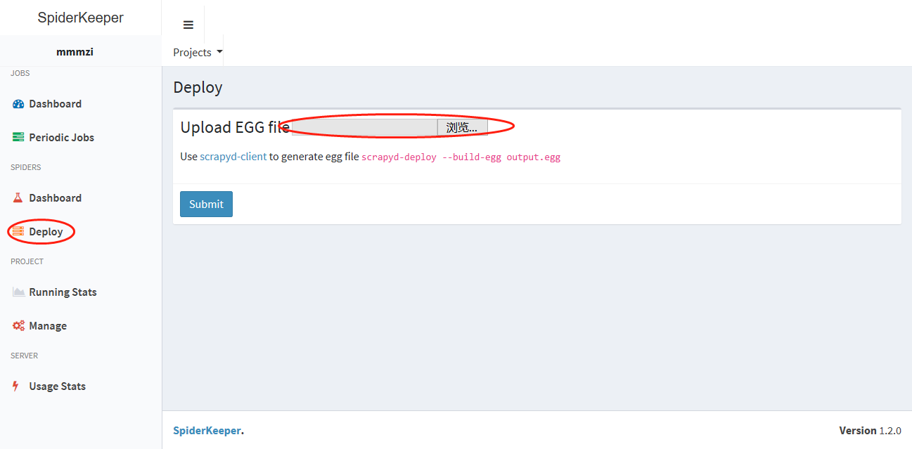
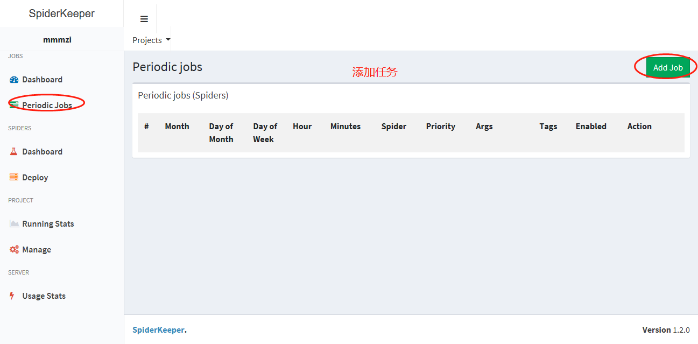
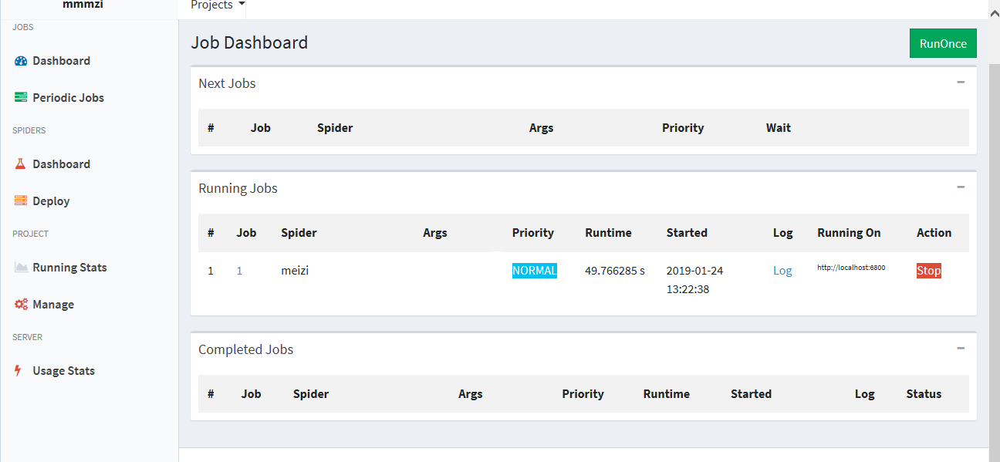
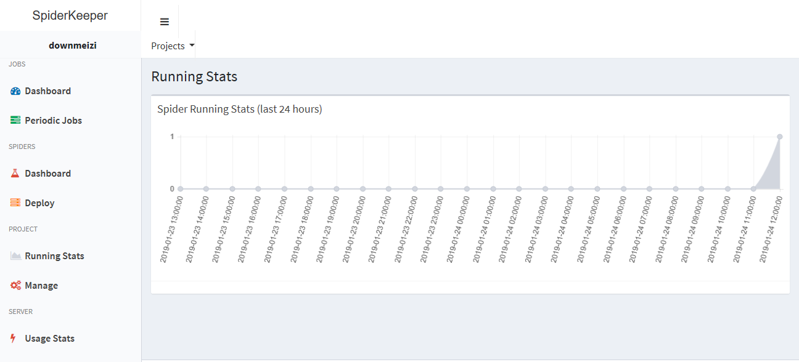

# spidermeizi
spider可视化管理


## 搭建环境
#### 软件安装
```
pip install scrapy          #安装scrapy

pip install scrapyd         #安装scrapy服务器

pip install scrapyd-client  #安装scrapy客户端
```

#### 运行scrapyd

###### 如果安装正常，则能正常运行

#### 对scrapy包生成egg包
##### 在项目工程下 scrapy.cfg  所在目录运行命令

```
scrapyd-deploy -p spidermeizi -v 0.0.01 --build-egg=meizi.egg
# 格式 ---->  scrapyd-deploy -p 项目名 -v 版本号 --build-egg=eggName.egg
```

#### 如运行scrapyd-deploy报错，原因是windows下 scrapyd-deploy是一个没有后缀的文件，需要如下操作
##### 在python安装目录Scripts所在目录下新建 scrapyd-deploy.bat文件，并如填写内容,并运行
```
@echo off
"C:\Python36\python.exe" "C:\Python36\Scripts\scrapyd-deploy" %1 %2 %3 %4 %5 %6 %7 %8 %9
# 相关路劲根据自己的安装环境配置
```
### 启动服务:
#### 在cmd端运行 scrapyd
#### 本地启动scrapykeeper （相关代码可以在github上搜索）

#












